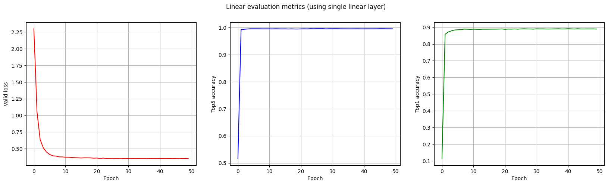

# Maximum Manifold Capacity Representations

This is a clean, opinionated and minimalist implementation of the training and evaluation protocols for a fancy new
self supervised learning (SSL) method called **maximum manifold capacity representations**. MMCR was introduced
in [Efficient Coding of Natural Images using Maximum Manifold Capacity Representations](https://openreview.net/pdf?id=og9V7NgOrQ)
paper. This repository **is not** a strict reimplementation of the experiments from the paper, rather just a playground
to try this
new SSL approach. If you want to check out the official implementation please
see [this](https://github.com/ThomasYerxa/mmcr/) repository.
Currently only `resnet18` model and `cifar10` dataset are supported, but it should be rather easy to add
more models and datasets.

## Installation

You will need at least **Python 3.10**.

```
# Download repository
git clone git@github.com:bartoszzuk/mmcr.git
cd mmcr

# [Optional] Setup virtual environment
python3 -m venv venv
source venv/bin/activate

# Install requirements
pip install -r requirements.txt
```

## Pretraining

Just use a `pretrain.py` script as shown below.

```
python pretrain.py \
    --dataset cifar10       # path to the dataset root
    --batch-size 64         # number of images per step
    --num-views 16          # number of augmented views per image
    --max-epochs 500        # number of training epochs
    --learning-rate 0.001   # learning rate for Adam optimizer
    --warmup-duration 0.1   # warmup duration for cosine scheduler
    --projection-dim 128    # dimension for output of projection head
    --num-neighbours 200    # number of neighbours to use for KNN evaluation
    --temperature 0.5       # temperature to use for KNN evaluation
```

Some details worth noting:

- The effective batch size is computed as `batch_size * num_views`.
- We use cosine scheduler with warmup instead of keeping the learning rate constant like in the original paper.
- We use `GaussianBlur` and `RandomSolarize` as additional augmentation methods.

## Finetuning

Just use a `finetune.py` script as shown below.

```
python pretrain.py \
    --checkpoint [YOUR_PRETRAINED_MODEL_CHECKPOINT]
    --dataset cifar10       # path to the dataset root
    --batch-size 1024       # number of images per step
    --max-epochs 50         # number of training epochs
    --learning-rate 0.01    # learning rate for Adam optimizer
    --warmup-duration 0.1   # warmup duration for cosine scheduler
    --finetune-type linear  # determines which parts to unfreeze, choose from [backbone+linear, linear]
```

Some details worth noting:

- We use cosine scheduler with warmup instead of just cosine scheduler like in the original paper.
- We use `GaussianBlur` and `RandomSolarize` as additional augmentation methods.

## Experiments

I ran both the `pretrain.py` and `finetune.py` script using the values shown in the examples above. I did **not**
conduct a proper hyperparameter optimization, just used the values that felt good :grimacing:.

### Pretrain Graphs


### Finetune Graphs



### Metrics

| Stage            | Model    | Dataset | Top1 Accuracy | Top5 Accuracy |
|------------------|----------|---------|---------------|---------------|
| Pretrain         | ResNet18 | Cifar10 | 86.32         | 99.39         |
| Finetune (Our)   | ResNet18 | Cifar10 | 89.19         | 99.61         |
| Finetune (Paper) | ResNet50 | Cifar10 | 93.53         | -             |

The results from the paper are shown just for reference. Since we are using smaller
model and different hyperparameters they are not very comparable.


